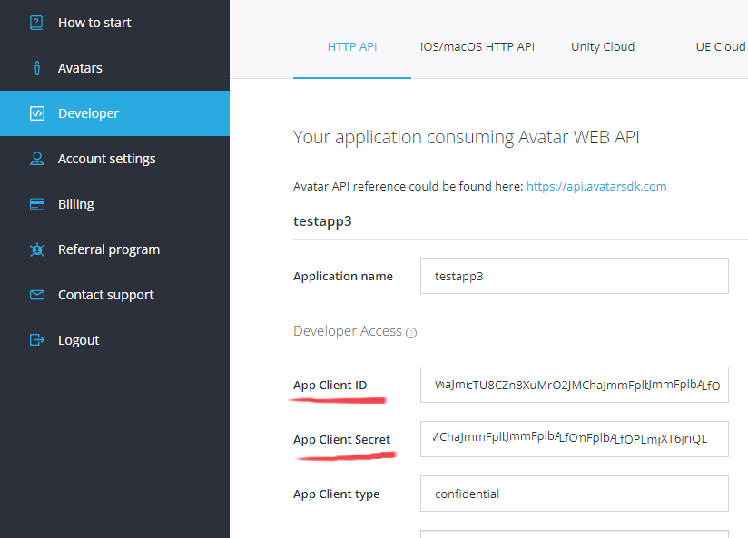
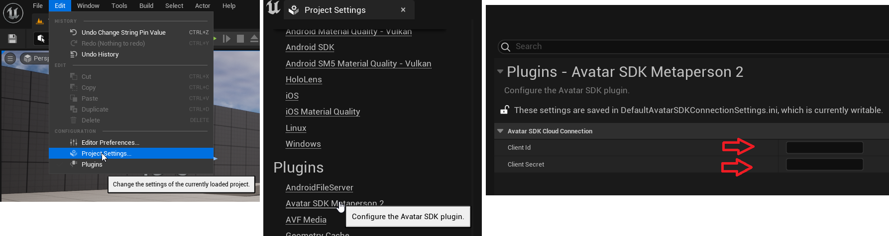
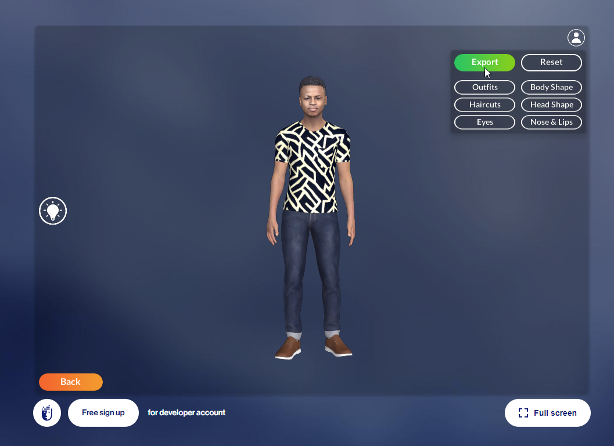
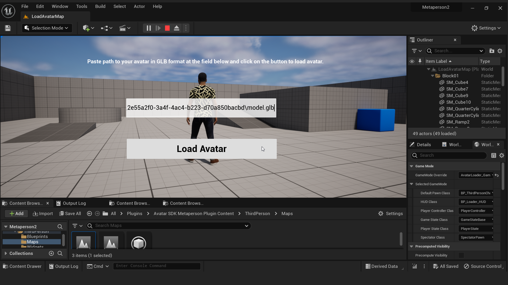

# Unreal Engine Marketplace Plugin

You can use our free official Marketplace Plugin to bring the functionality of Metaperson avatars to your Unreal Engine project. It contains tools to implement same functionality as in our Sample project. With this plugin you can create recognizable and customizable avatars. You can also load avatar at runtime and use it as a character in your project. Plugin contains two demo scenes: the first one with the help of the Metaperson Creator shows how to create the Metaperson avatar, customize and export it to the "Third Person" scene. The second demonstrates how to load an avatar at runtime from a local drive to a "Third Person" scene.

## "Third Person" Map

The *Third Person* Map is based on the original Epic's [template](https://docs.unrealengine.com/5.0/en-US/third-person-template-in-unreal-engine/). You may find it in the */AvatarSDKMetaperson2/ThirdPerson/Maps/* folder of the plugin. In this map you can create and customize the avatar with the help of the [Metaperson Creator](https://avatarsdk.com/metaperson-creator/). After that you can export it to the scene. You will need an account on the Avatar SDK website to export MetaPerson avatars. If you don't have an account yet, you can create it [here](https://accounts.avatarsdk.com/). After that you can take a [free trial](https://avatarsdk.com/pricing-cloud/) of the Pro plan. It gives you acces to all of the needed features.

To run the demo scene you will need developer credentials that can be created/found at your [developer page](https://accounts.avatarsdk.com/developer/). Developer credentials are a pair of values (Client ID and Client Secret). 

See the [additional documentation](https://docs.metaperson.avatarsdk.com/getting_started.html#developer-credentials) on the developer-credentials. 

Go to the Edit->Project Settings->Plugins->Avatar SDK Metaperson 2 section in UE Editor and set these parameters in corresponding fields:

Playing the level opens MetaPerson Creator in the HUD. After that all of the avatar creation/customization features are available to user. When the user finishes the avatar creation process, he can press the Export button. **If you’ve incorrectly added your credentials, or if your account doesn’t have a Pro plan or higher, the Export button may be inactive.**  

When the export process is complete, the MetaPerson Creator will close and the download will begin. The archive with the avatar will be saved to the local disk and unzipped. After that skeletal mesh of the avatar will be loaded from the glb file. Avatar will be placed in the level instead of the third person character.

See more information about [animation retargeting](animation_retargeting) and  [MetaPerson Creator integration](metaperson_creator_integration).

## "Load Avatar" Map

*Load Avatar* Map has similar functionality to the *Third Person Map*, but instead of creating an avatar using Metaperson Creator, you need to specify the path to an existing glb model. If the path you provided leads to the metaperson avatar, the avatar will be loaded and displayed on the scene instead of the default one. This functionality does not require you to provide credentials.

## Technical details

See this [page](metaperson_creator_integration) of the documentation for technical details.